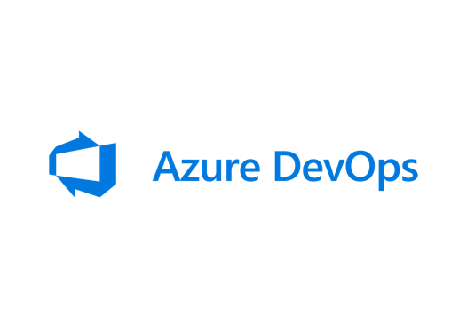

## Olá! ☺️ </h2>

- 👨‍💻Desenvolvedor .Net na <a href="https://www.linkedin.com/company/zinkglobal/about/">**Zink**</a>.
- 🌱 Estudando e aprendendo cada vez mais: **Inglês, .Net, DevOps e C#**.
- 💖 Interesses: Tecnologia 💻, Jogos 👾 e uma boa conversa 😁.

### Linguagens e Ferramentas

  
  
  
  
    
  
  
  
   

### Encontre-me na internet 🌎:

- 💼 Conectando com pessoas e compartilhando conhecimento profissional no <a href="https://www.linkedin.com/in/diego-galante/">LinkedIn</a>.

### <h2>Nugets e Projetos</h2>

    Azure DevOps Tracker 🌟
  

  
   
  

    
    
  

  

   
  
     Com o Azure DevOps Tracker é possível obter informações detalhadas sobre o ciclo de vida de cada Workitem abrindo um leque gigantesco de possibilidades para relatórios. 
   

     
Foi desenvolvido em parceria com <a href="https://github.com/ElvisCSouza">Elvis Souza</a>. 

   
Para saber mais sobre o projeto: 
     
   

  

<h2></h2>
  

  

    Schedule.io 📅
  

  
   
  

    
    
  

  

   
 Schedule.io é um nuget feito para auxiliar e encurtar o tempo de desenvolvimento de aplicações que possuem qualquer necessidade ligada a uma agenda entregando uma estrutura de fácil uso e moderna a medida que é atualizada. 
    Atualmente está em sua versão inicial e estamos trabalhando para que ela receba atualizações em breve. 

  
Foi desenvolvido em parceria com <a href="https://github.com/ElvisCSouza">Elvis Souza</a>. 

   
Para saber mais sobre o projeto: 
      
  

  

